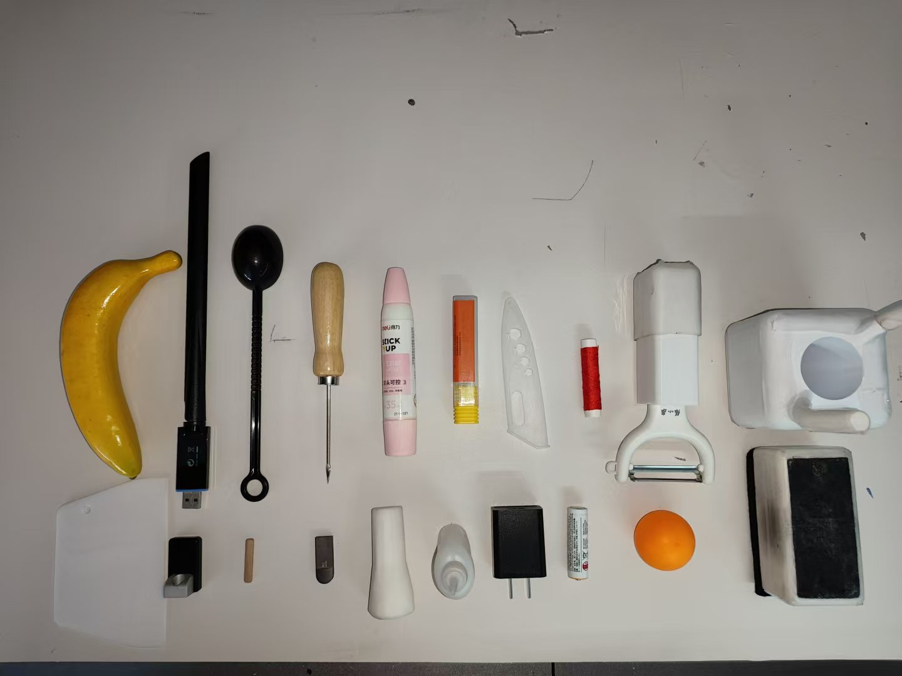
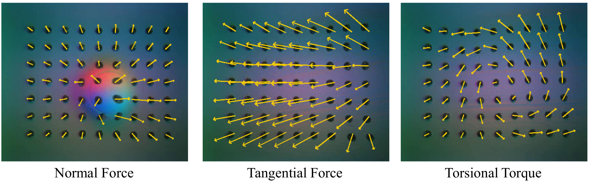

## Guidance for Tactile Dataset and Tactile Embedding
### 1. Prepare Objects
Prepare a few (>10) objects with different shapes, sizes and textures. The 20 objects we used in our tactile dataset is shown below:   

### 2. Collect Data
Use your hand to collect random interaction data between the object and the tactile sensor (e.g., GelSight Mini). Make sure that the interaction covers the following interaction patterns:

You can download the raw videos of the [tactile dataset](https://huggingface.co/datasets/WendiChen/reactive_diffusion_policy_dataset/tree/main/dataset_tactile_embedding) used in our paper for reference.

### 3. Extract Marker Motion
You can use [scripts/extract_gelsight_marker_motion.py](../reactive_diffusion_policy/scripts/extract_gelsight_marker_motion.py) to extract the marker motion ([zarr](https://github.com/zarr-developers/zarr-python) format) from the raw videos.

### 4. Generate Tactile Embedding
You can use the [scripts/generate_pca_embedding.py](../reactive_diffusion_policy/scripts/generate_pca_embedding.py) to generate the PCA tactile embedding (.npy format) from the marker motion dataset (zarr format).
You can find the pre-calculated PCA transformation matrix for our experiments in [data/PCA_Transform_GelSight](../data/PCA_Transform_GelSight).